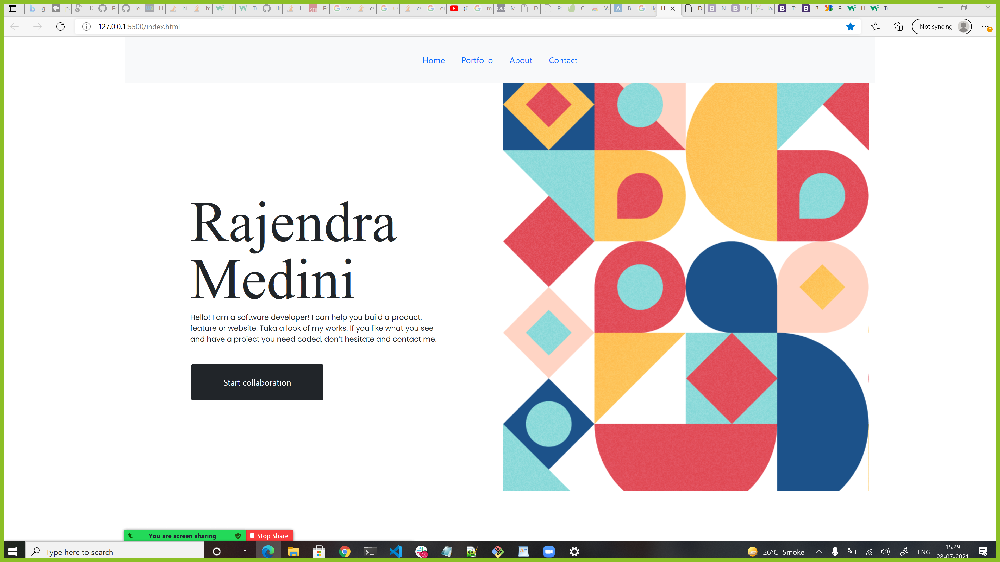

# Using Bootstrap to Design Website

> Bootstrap elements are used to design the website.

Additional description about the project and its features.

## Built With

- HTML, CSS, GitHub pages
- WebHint, StyleLint packages are used to check for linter errors
- Visual Studio

## Live Demo

[Live Demo Link](https://medini-rajendra.github.io/Bootstrap-Project/)

## Authors

👤 **Rajendra Medini**

- GitHub: [@Medini-Rajendra](https://github.com/Medini-Rajendra)
- Twitter: [@invenire512](https://twitter.com/invenire512)
- LinkedIn: [LinkedIn](https://www.linkedin.com/in/medinichaitanya/)

👤 **Obote Denise**

- GitHub: [@Obote](https://github.com/Obote)
- Twitter: [@Obote_denis](https://twitter.com/Obote_denis)
- LinkedIn: [Obote Denis](https://www.linkedin.com/in/obote-denis-9859a2a3/)

## 🤝 Contributing

Contributions, issues, and feature requests are welcome!

Feel free to check the [issues page](../../issues/).

## Show your support

Give a ⭐️ if you like this project!

## Acknowledgments

- Hat tip to anyone whose code was used
- Inspiration
- etc

## 📝 License

This project is [MIT](./MIT.md) licensed.
